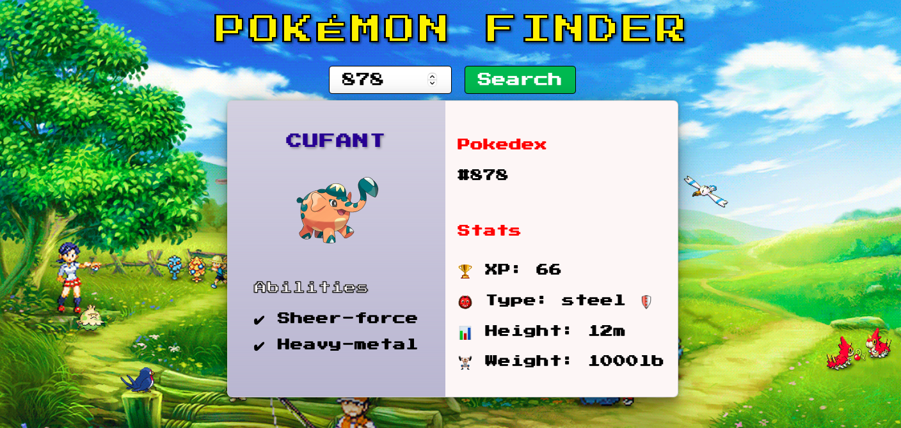

# Pokémon Finder

> A simple app to find Pokémons from 1 to 1010 using PokeAPI

## Table of contents

- [Pokémon Finder](#pokémon-finder)
  - [Table of contents](#table-of-contents)
  - [General info](#general-info)
  - [Screenshots](#screenshots)
  - [Technologies](#technologies)
  - [Setup](#setup)
  - [Code Examples](#code-examples)
  - [Features](#features)
  - [Status](#status)

## General info

> The objective of the project is to practice separation of concern in
> JavaScript as well as API consumption.

## Screenshots

;

## Technologies

- JavaScript
- HTML5
- CSS3
- VSC code

## Setup

clone the repo and start using the stop watch.

## Code Examples

```js
function removeElementIfExists(element) {
    if (element && element.parentNode) {
        element.parentNode.removeChild(element);
    }
}

export default removeElementIfExists;
```

## Features

List of features ready and Todos for future development

- Search Pokémon by ID

To-do list:

- Search Pokémon by name
- Display more descriptive data

## Status

Project is: _Done_
